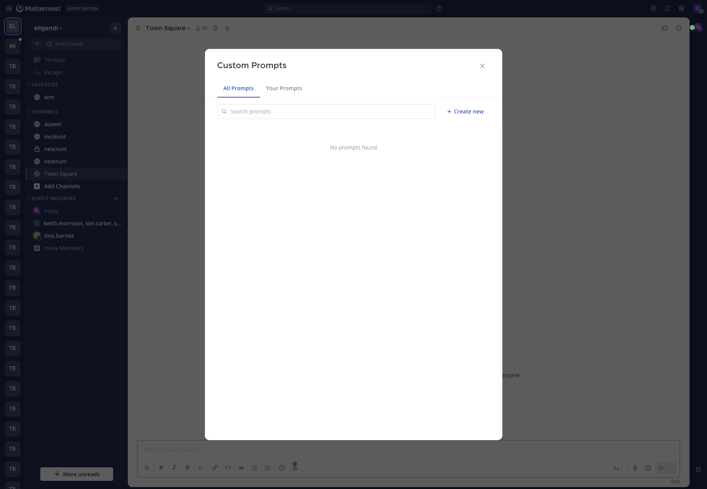

<!--
Copyright (c) 2023-present Mattermost, Inc. All Rights Reserved.
See LICENSE.txt for license information.
-->

# Custom Prompts

Custom Prompts are saved prompt templates you can reuse from the message composer or as shortcut buttons in the **Agents** pane. Use them to capture team workflows — incident triage, document review, runbook execution, code review checklists, status updates — once, then run them anywhere with the agent of your choice.

Each prompt has a title, an optional description, a system prompt template (the text that gets sent), and a visibility setting that determines whether other users in the workspace can use it. You can pin prompts so they appear as one-click buttons in the **Agents** pane.

## What replaced the old prompt buttons

In Mattermost Agents v1, the **Agents** pane shipped with a fixed set of starter buttons such as **Brainstorm ideas**, **Meeting agenda**, **To-do list**, and **Pros and Cons**. Selecting one of those buttons inserted a hard-coded phrase into the composer. Those buttons were removed earlier in the v2 development cycle and Custom Prompts replaced that pattern with a more durable system: instead of a fixed list, you and your teammates create your own prompts, share them across the workspace, and pin the ones you use most.

If you used the v1 starter buttons, recreate the ones you relied on as Custom Prompts and pin them. The pinned prompts appear in the same area of the **Agents** pane where the old buttons used to live.

## Create a custom prompt

To create a prompt:

1. Open the message composer in any channel or direct message.
2. Select **AI Actions**.
3. Open **Custom prompts**, then select **Manage prompts**.
4. Select **Create new** to open the prompt editor.
5. Set the **Visibility** to **Public** to share the prompt with other users in the workspace, or **Private** to keep it visible only to you.
6. Enter an **Action Title**. The title is required and can be up to 64 characters. It's the label that appears in menus and on pinned buttons.
7. Optionally enter a **Brief Description** to help you and others remember what the prompt is for.
8. Enter the **System Prompt** template. This is the text that gets rendered and sent on your behalf when the prompt runs. The template is required.
9. Select **Save**.

You can use the **Context Variables** button above the system prompt field to insert variables that get filled in with values from your current context (your username, the current channel, the current team, the time, and so on). See [Template variables](#template-variables) below for the full list.

## Share, pin, and manage prompts

Custom Prompts are managed from the **Custom Prompts** modal:

- The **All Prompts** tab shows prompts you created plus public prompts shared by other users.
- The **Your Prompts** tab shows only the prompts you created.
- Use the search box at the top of the modal to filter prompts by title or description.
- Select the pin icon on any row to pin or unpin a prompt for yourself. Pinning is per-user — you can pin your own prompts or any public prompt shared by another user. Pinned prompts appear as one-click buttons at the top of a new chat in the **Agents** pane.
- Select a prompt row to open a dedicated view inside the modal. Use the back arrow in the header to return to the list.

### Visibility and ownership

| Setting | Who can use it | Who can edit or delete it |
|---------|----------------|---------------------------|
| **Public** | Anyone in the workspace | Only the creator |
| **Private** | Only the creator | Only the creator |

When you open a public prompt that someone else created, it opens read-only — you can read the template, but the **Save** and **Delete** controls aren't shown. To pin it, go back to the list and select the pin icon on the prompt row. Only the prompt's creator can change its title, description, template, or visibility, or delete it.

## Reuse a prompt

There are two ways to run a saved prompt.

### From the message composer

1. Open the message composer in any channel, thread, or direct message.
2. Select **AI Actions**, then **Custom prompts**.
3. If multiple agents are configured for your workspace, choose the agent you want to use from the agent selector at the top of the menu.
4. Select the prompt you want to run.

Mattermost renders the template with your current context (channel, team, user, time, selected agent) and inserts the result into your draft. If you're not in a direct message with a bot, Mattermost also prepends the selected agent's `@mention` so the agent will respond in-thread when you post.

You can review and edit the rendered draft before sending it like any other message.



### From a pinned button in the Agents pane

1. Open the **Agents** pane and start a new chat.
2. Select the agent you want to use.
3. Select a pinned prompt button.

Pinned-prompt buttons render the template against your current context and post the rendered message immediately, then switch you into the resulting thread so you can read the agent's response. Use this when you want a faster path than opening the **Custom prompts** menu and confirming the draft.

> **Note:** Pinned-prompt buttons send the rendered message right away — there's no review step before posting. Use the composer flow if you want to edit the rendered text before sending.

## Template variables

Custom Prompt templates support the variables below. Variables use Go `text/template` syntax — `{{.Username}}`, `{{.Time}}`, and so on. The **Context Variables** dropdown in the editor inserts them at the cursor.

| Variable | Inserts |
|----------|---------|
| `{{.Username}}` | Your Mattermost username |
| `{{.FirstName}}` | Your first name |
| `{{.LastName}}` | Your last name |
| `{{.Channel}}` | The current channel display name |
| `{{.ChannelName}}` | The current channel name |
| `{{.Team}}` | The current team display name |
| `{{.TeamName}}` | The current team name |
| `{{.Time}}` | The current UTC time |
| `{{.BotName}}` | The selected agent's display name, when available |

If a value isn't available in the current context — for example, `{{.Team}}` when you're in a direct message that isn't tied to a team — Mattermost renders the variable as empty text. The rest of the template still runs normally.

`{{.BotName}}` is populated in the composer flow (where an agent is selected in the **Custom prompts** menu) but is empty when a prompt is run from a pinned button in the **Agents** pane.

## Compose with other Agents features

Custom Prompts are a way to draft and send a message — they don't change how the agent behaves once it receives that message. After your prompt is rendered and posted, the response uses the same Agents capabilities as any other conversation:

- **Agent selection.** The prompt runs against whichever agent is selected in the **Custom prompts** menu (composer flow) or the **Agents** pane (pinned-button flow). Switching agents lets you run the same prompt against different models or system instructions.
- **Channel context and summaries.** Prompts that include `{{.Channel}}` or `{{.ChannelName}}` give the agent the channel where you ran the prompt, but they don't automatically pull recent channel history. For "what happened in this channel" workflows, use [Channel Summaries](channel_summaries.md) — the **Ask Agents about this channel** entry point is purpose-built for that.
- **Tool calling.** Agent responses to a prompt go through the same tool approval flow as any other agent response. In direct messages, tool results are shared automatically with you. In channels (when your system admin has enabled channel-mention tool calling), only the person who ran the prompt can approve or reject pending tools, and the standard **Share** / **Keep Private** controls apply to tool results. See the **Use tools** section of the [user guide](../user_guide.md#use-tools).
- **MCP and external tools.** Custom Prompts don't bypass tool approval policies or MCP provider connection state — if the agent needs an MCP tool that you haven't connected yet, you'll see the same prompts you would in any other conversation.
- **File attachments.** Running a Custom Prompt from the composer updates the draft text but preserves any files already attached to the post.

## Examples

The system prompt template is the message that gets sent on your behalf, so write it as you would write a message to the agent. The examples below show common team workflows.

### Incident triage

Title: `Triage this channel`

```
You are helping me triage an active incident in the #{{.ChannelName}} channel on the {{.Team}} team. As of {{.Time}}, list:

1. The current status in one sentence.
2. The top 3 unresolved questions.
3. Suggested next steps and who is best placed to take them.

Use the channel context to ground every answer.
```

### Document review

Title: `Doc review`

```
Review the document I'll attach next as if you were a careful technical editor. Flag:

- Unclear claims or missing context.
- Inconsistent terminology.
- Sections that read as filler vs. sections that carry real signal.

Format the response as a short bulleted list of issues, each with a one-line suggested fix.
```

### Runbook execution

Title: `Run the on-call playbook`

```
I'm {{.FirstName}} ({{.Username}}) on call. Walk me through our standard "service is degraded" playbook step by step. After each step, wait for me to confirm before continuing. If you need any tools to check service state, ask first.
```

### Code review checklist

Title: `Code review checklist`

```
Apply our team's code review checklist to the diff I'll paste next:

1. Naming and readability.
2. Error handling and edge cases.
3. Test coverage of the new behavior.
4. Backwards-compatibility risk.
5. Anything that should be split into a separate PR.

Be concise. Use bullets, not prose.
```

You can save these as **Public** prompts so the rest of your team can pin and reuse them.

## Limits and gotchas

- **Title length.** Prompt titles are limited to 64 characters.
- **Required fields.** Both **Action Title** and **System Prompt** are required. **Brief Description** and **Visibility** default to private if you leave them alone.
- **Variable scope.** The variables listed in [Template variables](#template-variables) are the only ones available — Custom Prompt templates can't reference arbitrary fields. Variables that aren't available in the current context render as empty text.
- **Per-user pins.** Pinning is per-user. Pinning a public prompt that someone else owns pins it only for you — it doesn't affect other users.
- **Pinned-button posts are immediate.** Selecting a pinned prompt in the **Agents** pane sends the rendered message right away. Use the composer flow if you want to edit before sending.
- **Editing other people's prompts.** Public prompts you didn't create open read-only. Ask the prompt's creator to make changes, or copy the template into a new prompt of your own.
- **Deletion is soft.** Deleting a prompt removes it from listings and unpins it for everyone, but only the creator can delete a prompt they own.
- **System Prompt length.** No explicit character limit is enforced by Agents. The practical ceiling is the HTTP request body limit configured for your Mattermost server (typically several megabytes). Note that very long prompts may reduce the context window available for the agent's response.
- **Render uses the agent selected when you click.** After the prompt is rendered and inserted into the draft, the @mention is already in the text. If you want to target a different agent, edit the @mention manually before posting.

## Related docs

- [Mattermost Agents User Guide](../user_guide.md) — overall feature overview, including the **AI Actions** menu, agent selection, and tool approval.
- [Channel Summaries](channel_summaries.md) — the dedicated entry point for analyzing channel activity.
- [Multiplayer Tool Calling](multiplayer_tool_calling.md) — how tool approval works when an agent responds to a prompt in a channel.
- [Managing Agents](managing_agents.md) — creating, configuring, and sharing the agents that custom prompts run against.
