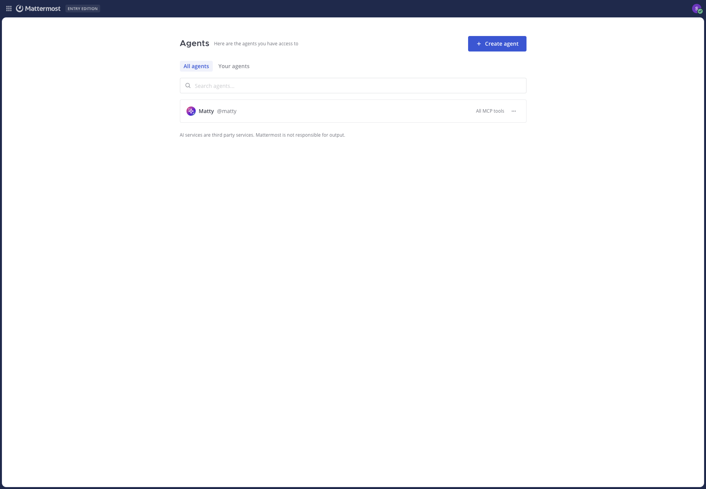

<!--
Copyright (c) 2023-present Mattermost, Inc. All Rights Reserved.
See LICENSE.txt for license information.
-->

# Managing Agents

Mattermost Agents V2 turns agent management into a first-class product surface. Each agent is a database-backed identity with its own bot user account, instructions, model, access rules, and MCP tool grants. This guide explains where agents live in the product, who can manage them, and how to create, edit, and delete them.

For broader plugin configuration (services, web search, embedding search, MCP servers, per-tool policies), see the [Admin Guide](../admin_guide.md). For chat usage and tool approval flows, see the [User Guide](../user_guide.md).

## Overview

In v2, an agent is more than a JSON entry in plugin config. Each agent has:

- A persistent record in the `Agents_UserAgents` database table. Migrations `000005` and `000006` create the table and add the model, native-tool, reasoning, and structured-output columns.
- A linked Mattermost bot account. Display name and avatar updates on the agent flow through to that bot account; deleting an agent deactivates the bot.
- A creator (`CreatorID`) and an optional list of agent admins (`AdminUserIDs`). The creator is always an admin and can't be removed from that role.
- Channel and user access rules and an MCP tool allowlist (or "all MCP tools" auto-grant) stored on the same record.
- Cluster-aware change propagation: when an agent is created, edited, or deleted, the originating node refreshes its bot cache, publishes a `agent_update` cluster event, and broadcasts a `bots_invalidate` websocket event so every node and connected client picks up the change.

This means agent identity, instructions, scoping, and tool grants are part of your Mattermost data — they live in the same database as your channels and users, are covered by your normal Mattermost backups, and survive plugin restarts and upgrades.

## Where Agents live in the product

Agents is a top-level Mattermost product entry, not a plugin panel. It registers itself with the Mattermost product switcher (the grid icon) so the Agents page renders inside the Mattermost shell with full theming.

You can reach the Agents page in three ways:

- Use the **product switcher** (grid icon) and select **Agents**.
- Open the URL `/plug/mattermost-ai/agents` directly.
- From a conversation, open **AI Actions > Manage agents**.

The **System Console > AI Bots** page no longer hosts the agent editor. Instead, it shows an **AI bot configuration has moved** notice with a link back to the Agents page. System administrators can still set the default bot in the same System Console section, just below the redirect notice — but creating, editing, and deleting agents happens on the Agents page.

The Agents page itself shows:

- A header with the page title and a **Create agent** button (visible only to users who can create agents — see [Permissions and license](#permissions-and-license)).
- Two tabs: **All agents** (every agent the user can see) and **Your agents** (agents the current user created).
- A search box that filters by display name or username.
- One row per agent showing the avatar, display name, `@username`, an **All MCP tools** or **N tools** badge, and a **Service unavailable** warning badge if the agent's configured AI service is missing.
- A row-level overflow menu (`⋯`) with **Edit** and **Delete** actions for users who can manage that agent. Selecting the row itself also opens the editor for users who can manage the agent.

## Permissions and license

Agent management uses three Mattermost system permissions plus a license check.

### Permissions

| Permission | Capability |
|---|---|
| `manage_own_agent` | Create new agents and edit/delete agents the user is an admin of. |
| `manage_others_agent` | Edit and delete any agent on the server, including agents the user did not create. |
| `manage_system` | System administrator. Always allowed to manage agents that have no creator (migrated legacy bots) and may create agents in the absence of `manage_own_agent`. |

The Agents page applies these rules consistently between the UI and the API:

- The **Create agent** button is shown to users with `manage_own_agent` or `manage_system`.
- A row's **Edit/Delete** actions are available to:
  - The agent's creator,
  - Anyone listed in the agent's **Agent admins** field,
  - Anyone with `manage_others_agent`,
  - System administrators, when the agent has no creator (a migrated legacy bot — see [Legacy bot migration](#legacy-bot-migration)).
- The same checks gate the underlying `POST /agents`, `PUT /agents/:id`, and `DELETE /agents/:id` API routes, so direct API calls cannot bypass the UI rules.

By default, regular users do not have `manage_own_agent`. Grant it through your existing Mattermost role/permission model to delegate agent creation — typically under **System Console > User Management > Permissions** (exact path varies by Mattermost server version).

### License

Self-service agent creation is gated by Mattermost's multi-LLM license check (Entry, Enterprise, or Enterprise Advanced).

- **Without a multi-LLM license**, the Agents page shows a **Self-Service Agents** upgrade screen with a link to Mattermost pricing instead of the agent list. The plugin enforces a limit of `1` self-service agent at the API level (the `FreeTierAgentLimit` constant in `api/api_agents.go`), but **there is no UI path to create it** — agent creation requires a qualifying license. The API safety rail returns HTTP 403 with the message *"creating more than 1 self-service agent(s) requires an E20 or Enterprise license"* for any over-limit creation attempt.
- **With a multi-LLM license**, agent creation is unlimited (subject to permissions).

For the full feature/license matrix, see [License requirements](../admin_guide.md#license-requirements) in the Admin Guide.

## Creating an agent

1. Open the **Agents** page.
2. Select **Create agent**. A full-page editor opens with three tabs: **Configuration**, **Access**, and **MCPs**.
3. Fill in the tabs (see below). Required fields are validated when you save.
4. Select **Save**. The plugin creates a Mattermost bot user, persists the agent record, propagates the change to other cluster nodes, and returns you to the Agents list.



### Configuration tab

The Configuration tab covers identity, model selection, custom instructions, and per-agent capability toggles. The fields that appear depend on the AI service you select.

| Field | Description |
|---|---|
| **Display name** | Required. The user-facing name shown in posts, the agent list, and the RHS picker. Updating the display name also updates the linked Mattermost bot's display name. |
| **Agent username** | Required. The `@mention` handle for the agent. Must start with a letter and contain only lowercase letters, numbers, periods, hyphens, and underscores. Maximum 22 characters in the UI. The server-side validator does not enforce a length limit; direct API callers are constrained only by the database schema (`VARCHAR(64)`). **The username is set when the agent is created and cannot be changed afterward.** |
| **Agent avatar** | Optional. Upload a custom image. Avatar upload is a second step after the agent record is created or updated; if the avatar upload fails the rest of the save still succeeds. |
| **AI Service** | Required. Pick a configured service from the dropdown. Services are managed in **System Console > Plugins > Agents** and shared across agents. If the agent references a service that has been deleted, an "Unknown service (deleted)" entry appears in the dropdown until you pick a new one. |
| **Model** | Optional. Override the service's default model for this agent. For OpenAI, Anthropic, Azure, OpenAI Compatible, Gemini, and Vertex AI services the field becomes a combobox populated by a live model fetch from the provider; for other services it is a free-text field. Leave empty to use the service default. |
| **Custom instructions** | Free-text. Prepended to every request as the agent's system prompt. Use it for tone, role, vocabulary, or workflow guidance. |
| **Enable Vision** | Available for service types that support image input. Lets the agent process attached images. Requires a vision-capable model. |
| **Enable Tools** | Available for service types that support tool calling. When off, the agent runs without tools and the **MCPs** tab is disabled. Some Mattermost Agents features will not work without tools. |
| **Native provider tools** | Available when the selected provider exposes native tools (Anthropic, OpenAI on Responses API, Gemini, Vertex AI, and OpenAI Compatible/Azure when **Use Responses API** is on). Pick which native tools (such as web search) the agent may use. |
| **Reasoning** | Available for Anthropic, OpenAI (Responses API), Gemini, and Vertex AI services. Lets you enable extended thinking and pick a reasoning effort or thinking budget. |
| **Structured Output** | Available for Anthropic, OpenAI, OpenAI Compatible, and Azure services. When enabled and a JSON schema is supplied at request time, the model returns valid JSON matching the schema. For Anthropic services, **Structured Output** and extended thinking cannot be enabled at the same time — turning Structured Output on temporarily disables reasoning, and turning it off restores your previous reasoning setting. |

Switching the **AI Service** to a service of a different type clears the model field and resets the native tools, reasoning, thinking budget, and structured output fields back to defaults so you don't carry stale provider-specific values across providers. Switching between two services of the same type (for example two OpenAI Compatible entries) preserves those fields.

If the form is invalid when you select **Save**, validation errors are shown inline (display name required, username required and must match the allowed pattern, AI Service required) and the editor returns to the Configuration tab.

### Access tab

The Access tab controls who can interact with the agent and who can administer it.

- **Channel access** restricts the channels in which the agent can be `@mentioned`:
  - **All channels** (default): the agent works in every channel where it is a member.
  - **Allow only**: the agent only responds in the channels you list.
  - **Block**: the agent responds everywhere except the channels you list.
  - **None**: the agent cannot be used in channels at all (DM-only).
- **User access** restricts which users can interact with the agent:
  - **All users** (default): anyone in the workspace.
  - **Allow only**: only listed users, or members of listed teams.
  - **Block**: everyone except listed users or members of listed teams.
- **Agent admins** is a list of users who can edit and delete this agent in addition to the creator. The agent creator is always an admin and is not shown in the editable list.

These rules are enforced both for `@mentions` in channels and for direct conversations with the agent. They are enforced in the server in `bots/permissions.go`, so they apply uniformly to UI flows, slash commands, and tool-driven access.

### MCPs tab

The MCPs tab is available only when **Enable Tools** is on (Configuration tab). It controls which MCP tools the agent may call.

- **Automatically enable all MCP tools**: the agent has access to every MCP tool available in the server right now and to any MCP tools added later. This is the default for new agents and the setting used by all migrated legacy bots.
- When the auto-grant is off, pick the specific MCP tools to enable. Tools that are no longer present on the server are dropped from the agent's allowlist when you save.
- For OAuth-backed MCP servers, you can also start the per-user **Connect** flow directly from this tab. Enabling a server that is currently disconnected stores a wildcard grant — once you finish the OAuth flow, the agent gets every tool that server exposes. The tab refreshes automatically when you connect or disconnect (`mcp_connection_updated` websocket event).

Per-tool **approval policies** (`ask`, `auto_run`, `auto_run_everywhere`) are configured by an administrator in **System Console > Plugins > Agents > Model Context Protocol (MCP) > Tools**. Granting a tool to an agent on the MCPs tab does **not** override those policies — runtime approval still applies. For more on the approval model, see [Multiplayer Tool Calling](multiplayer_tool_calling.md).

## Editing an agent

To edit an agent:

1. Open the **Agents** page.
2. Select the row, or open the row's `⋯` menu and choose **Edit**.
3. Update fields across the three tabs as needed. The editor opens on the **Configuration** tab and remembers your tab selection while editing.
4. Select **Save**.

The editor uses a full-document `PUT /agents/:id` save, so every visible field on every tab is sent on save. There is no per-field partial update.

### What's editable vs locked

- **Display name**, **avatar**, **service**, **model**, **custom instructions**, **vision**, **tools**, **native tools**, **reasoning**, **structured output**, **channel access**, **user access**, **agent admins**, and the **MCP tool grants** can all be changed at any time.
- **Agent username is permanent.** Once the agent is created, the username field is disabled in the editor. The Mattermost bot account is keyed off this username, and changing it would orphan existing `@mentions` and conversation history. To use a different username, create a new agent.

### Unsaved-changes warning

If you have unsaved changes and try to leave the editor — by selecting **Cancel**, pressing **Escape**, or selecting the back arrow — Mattermost shows a **Discard changes?** confirmation with **Discard** and **Keep editing** buttons. **Discard** abandons your edits and returns to the Agents list. **Keep editing** dismisses the prompt and leaves you in the editor.

The dirty-state check considers both form fields and a queued avatar upload, so swapping the avatar but making no other change will still trigger the warning.

### Effect of edits on running conversations

- Updating the agent's display name flows through to the linked Mattermost bot's display name immediately.
- Updating the AI service, model, or instructions takes effect on the next agent turn — in-flight responses already streaming to a user are not interrupted.
- Updating channel/user access rules takes effect immediately for new mentions; the next time a user `@mentions` the agent in a channel that is now blocked, the agent will refuse the request.

## Deleting an agent

To delete an agent:

1. Open the **Agents** page.
2. Open the row's `⋯` menu and select **Delete**.
3. Confirm in the **Delete agent** dialog. The action cannot be undone.

Deleting an agent:

- Soft-deletes the row in `Agents_UserAgents` (sets `DeleteAt`).
- Deactivates the linked Mattermost bot account, so `@mentions` no longer route to it.
- Publishes a cluster event so every Mattermost node refreshes its bot cache, and broadcasts a `bots_invalidate` websocket event so connected webapp clients drop the agent from their pickers.

Existing posts that mention or were authored by the agent remain in channels with their original content; only the agent's ability to reply to new requests is removed. Custom prompts that referenced the agent by username may no longer resolve that agent after deletion.

## Legacy bot migration

Mattermost Agents V1 stored bot definitions inline in the plugin's `config.bots` array in `config.json`. V2 moves agents into the database. To make this transition automatic, the plugin runs a one-time migration on startup.

### What happens on upgrade

When the v2 plugin first activates against a server that previously used v1:

1. The plugin acquires a cluster mutex (`ai_legacy_bots_migration`) so only one node performs the migration.
2. It reads the stored config and, for each entry in `config.bots` that is not already represented in `Agents_UserAgents`, creates a new agent record. The existing Mattermost bot user account is reused; only the agent record is new.
3. Each migrated agent is created with `AutoEnableNewMCPTools = true` so it preserves the legacy "all tools allowed" behavior. The MCP tool allowlist is not carried over from any prior gate because v1 bots had access to every MCP tool by default.
4. Each migrated agent has an **empty `CreatorID`** and an **empty admin list**. This is what marks them as legacy. Any system administrator (`manage_system`) can edit or delete migrated agents from the Agents page.
5. The plugin clears `config.bots` from the stored configuration to prevent duplicate bot registration on the next run, and writes `legacy_config_bots_migrated = true` to the system table so the migration does not run again.

### Soft-deferred migration

If a config bot exists but its corresponding Mattermost bot account isn't yet registered (which can happen during a fresh plugin enable that occurs before the bot owner runs `EnsureBots`), the migration **defers** instead of creating partial records:

- No agents are created.
- `config.bots` is **not** cleared.
- The migration flag is **not** set.
- A warning is logged: *Deferring legacy bot migration: Mattermost bot not found*.

The migration retries on the next config update or plugin reload. This is the expected behavior for e2e and fresh-install scenarios — no operator action is needed.

### How to verify migration

After upgrading:

1. Open the **Agents** page. Each pre-existing v1 bot should now appear as an agent row.
2. Open **System Console > AI Bots**. You should see the **AI bot configuration has moved** notice with a link to the Agents page.
3. Confirm in the database that `Agents_UserAgents` contains the expected number of rows and that `config.bots` is empty in the stored plugin configuration. Use:
   ```bash
   mmctl config get PluginSettings.Plugins.mattermost-ai.bots
   ```
   ```sql
   SELECT COUNT(*) FROM Agents_UserAgents WHERE DeleteAt = 0;
   ```
4. Confirm that the system value `legacy_config_bots_migrated` is set to `true`. The flag lives in the plugin-owned `Agents_System` table — there is no `mmctl` command for plugin-specific system tables, so this check is SQL-only:
   ```sql
   SELECT SValue FROM Agents_System WHERE SKey = 'legacy_config_bots_migrated';
   ```

If migration was not performed (because no `config.bots` entries existed) the flag is **not** set; the plugin will check again the next time configuration changes. This is intentional: enabling the plugin on a clean instance and then importing bots later should still trigger the one-time migration.

### Backups

`Agents_UserAgents` is a plugin-owned table and is included in standard Mattermost database backups. Plain `mattermost-config.json` snapshots are no longer sufficient to restore agents — they contain only services and the default-bot setting, not agent definitions. See [Backup and restore](../admin_guide.md#backup-and-restore) for details.

## HA cluster behavior

Agent changes propagate across Mattermost cluster nodes through two channels: a plugin cluster event and a webapp websocket broadcast.

When an agent is created, edited, or deleted on any node:

1. The node that handled the request **refreshes its own bot cache**, calling `EnsureBots()` so the new or changed agent is loaded into memory immediately.
2. The plugin **publishes an `agent_update` cluster event** using `model.PluginClusterEventSendTypeReliable`. Every other plugin node receives it via `OnPluginClusterEvent` and triggers the same forced refresh.
3. The plugin **broadcasts a `bots_invalidate` websocket event** to all connected clients (`custom_mattermost-ai_bots_invalidate`). Webapp clients invalidate their RHS bot picker cache and refetch.

The same channels carry plugin **config updates** (`config_update` cluster event) so service changes made in one System Console session are picked up cluster-wide.

Practical consequences:

- Agent changes are visible cluster-wide within seconds. There is no need to restart the plugin or stagger updates across nodes.
- If the cluster event is dropped (for example because a node briefly leaves the cluster), the next config or plugin reload on that node forces a fresh DB load, so agents will not stay stale indefinitely.
- The migration mutex ensures that legacy bot migration runs on exactly one node even when several nodes start simultaneously.

`EnsureBots()` is called during `OnActivate()` (`server/main.go:220`), so a node that never receives an `agent_update` event will still load DB-backed agents on startup.

## Troubleshooting

### "Self-Service Agents" upgrade screen is shown instead of the agents list

The server does not have a multi-LLM license applied. Apply an Entry, Enterprise, or Enterprise Advanced license in **System Console > About > Edition and License** to unlock the Agents page. There is no UI path to create the single free-tier agent permitted by `FreeTierAgentLimit`; that limit is an API-only safety rail and direct API access would be required to use it (not typical for end users).

### "Create agent" button is hidden

The signed-in user does not have `manage_own_agent` or `manage_system`. Grant `manage_own_agent` through your role/permission configuration, or sign in as a system administrator.

### "Edit" and "Delete" actions are not shown for an agent

The signed-in user is not the agent's creator, not in **Agent admins**, and does not have `manage_others_agent`. For migrated legacy bots (no creator), only system administrators see these actions.

### Agent shows "Service unavailable" badge

The agent's `serviceID` no longer matches any service in **System Console > Plugins > Agents**. Edit the agent and pick a current service from the dropdown, or restore the missing service in System Console.

### Saving an agent returns "This username is already taken"

Another agent (active or recently deleted) already uses the username. Pick a different username. Usernames cannot be changed after creation, so attempting to edit the conflicting agent is not a workaround — delete that agent if it is truly unused, or pick another name.

### Saving an agent returns "creating more than 1 self-service agent(s) requires an E20 or Enterprise license"

You are at the free-tier limit and the server does not have a multi-LLM license. Apply a qualifying license, or delete the existing agent before creating a replacement.

### Avatar didn't update after save

Avatar upload runs as a second request after the agent record is saved. If the avatar upload fails (network blip, image too large, unsupported format), the agent record is still saved successfully but the avatar is unchanged. Re-open the editor, re-select the file, and save again. Avatar upload enforces a 10 MB maximum size. There is no content-type pre-validation in the plugin; the Mattermost server's profile image processing handles format checks.

### Editor shows the previous agent's avatar after switching agents

This was a known issue (MM-68531, fixed in PR #690). If you observe this on a v2.0 build, confirm the plugin version includes that fix and refresh the page.

### MCPs tab is grayed out

The agent has **Enable Tools** turned off in the Configuration tab. Turn it back on to access MCP configuration. Some product features (channel summaries with tool-backed actions, tool-using custom prompts) will not work for this agent until tools are enabled.

### MCP server is shown but tools list is empty

For OAuth-backed MCP servers, each user must complete the OAuth flow before tools are visible. Use the **Connect** button on the MCPs tab — or in the Agents RHS **Tools** popover — to start the flow. Until you connect, you can still toggle the server on; this stores a wildcard grant so the agent gets every tool the server exposes once you authenticate. See [OAuth-backed MCP servers](../admin_guide.md#oauth-backed-mcp-servers) for details.

### Agent change isn't visible on another cluster node

Cluster propagation is fast but not synchronous. Wait a few seconds and refresh the Agents page on the other node. If the agent still doesn't appear, check the plugin logs on that node for *Failed to re-ensure bots after agent update cluster event* or *Failed to publish agent update cluster event* — both indicate the cluster event channel itself is unhealthy. A plugin reload on the affected node forces a fresh DB load.

### Cannot delete a migrated legacy bot

Migrated legacy bots have no creator and no agent admins, so only system administrators (`manage_system`) can delete them. Sign in as a system administrator and try again.

## Related docs

- [Admin Guide](../admin_guide.md) — installing the plugin, configuring services, embedding search, MCP servers, per-tool policies.
- [Upgrading to 2.0](../upgrading_to_2.0.md) — full upgrade path including the `config.bots` → DB migration covered above.
- [Custom Prompts](custom_prompts.md) — reusable prompt templates that can target a specific agent.
- [Multiplayer Tool Calling](multiplayer_tool_calling.md) — how tool approval works in channels, including the initiator-only approval rule.
- [Providers](../providers.md) — provider-specific configuration referenced by the **AI Service** field.
