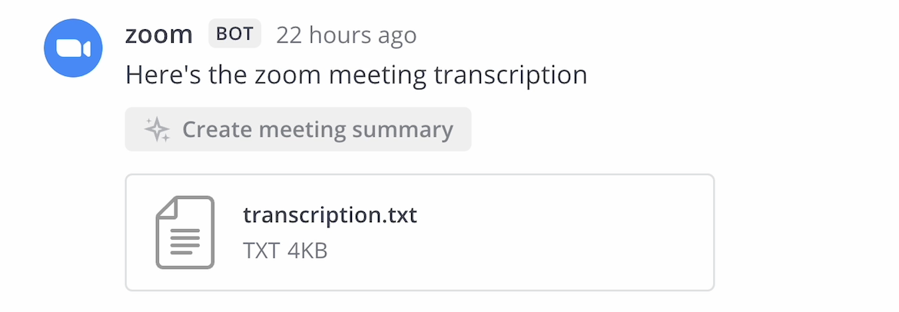
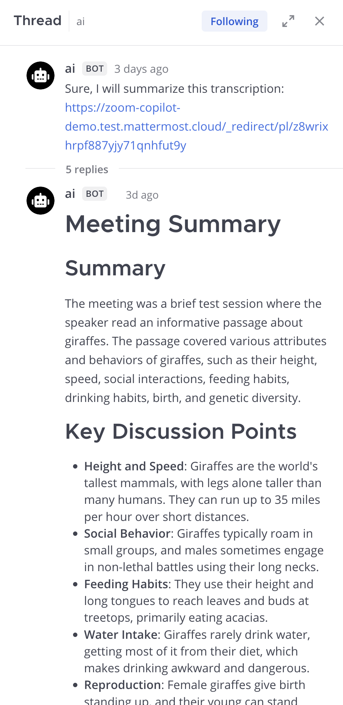

# Mattermost Agents User Guide

This guide explains how to use the AI features available through the Mattermost Agents plugin. This plugin transforms Mattermost into an AI-enhanced collaboration platform to improve team productivity and communication.

With Mattermost Agents, you can summarize call and meeting recordings, turn long threads and unread channel messages into concise summaries, stay on top of your messages by identifying next steps and decisions, extract learnings and transform content into charts and documentation, dig further into any topic by asking for insights, and leverage voice dictation tools for hands-free communication.

## Access AI features

You can access AI features in Mattermost in the following ways:

### Web and desktop

Access AI features in one of the following ways:

- Select the **Agents** icon in the apps sidebar.
- @mention an AI bot in any channel where you have access (such as `@copilot`).
- Open the **AI Actions** menu in the message composer to insert saved **Custom prompts** templates or open **Manage prompts**.
- Use the **AI Actions** menu by hovering over the first message in any conversation thread (see [license requirements](admin_guide.md#license-requirements))
- Use the **Ask AI** option in channels with unread messages (see [license requirements](admin_guide.md#license-requirements))
- Use **Ask Agents about this channel** in a channel header to summarize recent activity, focus on a date range, or ask a question about the current channel. See [Channel Summaries](features/channel_summaries.md).

### Mobile

Start or open a direct message with the Agent bot. If your system admin has configured multiple bots, switch between them by starting or opening each bot by name.

## Conversational AI features

### Chat with agents

You can have conversations with Agents in several ways:

**Agents pane**: Use the Agents right-hand pane for a streamlined experience. Begin with suggested prompts or pinned custom prompt buttons, or engage in a private thread with an Agent for a tailored experience. If you have follow-up questions or need further insights, simply ask. You can also attach files for AI analysis or reference.

**Direct messages**: Start a direct message with an Agent bot to have a private conversation. Chat privately with an Agent in direct message threads like you would any other Mattermost user.

**Channel mentions**: [@mention](https://docs.mattermost.com/collaborate/mention-people.html) Agent bots by their username, such as `@copilot`, in any thread to bring Agents capabilities to your conversation. The bot responds in a thread to keep channels organized, and other team members can view and contribute to the conversation. An Agent can help extract information quickly or transform discussions into charts, resources, documentation, and more, and can find action items and open questions in new messages.

> **Note:** Whether AI-generated links are clickable depends on your system admin configuration. Treat links in AI responses with caution and verify destinations before opening them.

### Select a bot

If multiple Agent bots are configured for your Mattermost workspace, select your preferred bot in the Agents pane or @mention specific bots by name in channels.

### Use custom prompt templates

Custom prompts are saved prompt templates that you can reuse from the message composer or from pinned buttons in the Agents pane.

To manage custom prompts:

1. Open the message composer in any channel or direct message.
2. Select **AI Actions**.
3. Open **Custom prompts**, then select **Manage prompts**.
4. Select **Create new** to add a prompt with an **Action Title**, optional description, and template.
5. Choose **Public** to share the prompt with other users, or **Private** to keep it visible only to you.
6. Pin prompts you use often so they appear as shortcuts in the Agents pane.

The **All Prompts** tab shows prompts you created plus shared prompts from other users. The **Your Prompts** tab shows only prompts you created. Shared prompts from other users are read-only. Only the prompt creator can edit or delete a prompt. Prompt titles can be up to 64 characters, and every prompt requires a template.

When you select a saved prompt from **Custom prompts**, Mattermost renders the template with the current context and inserts the result into your draft. If you use this menu outside a bot direct message, Mattermost adds the currently selected bot mention before the rendered text. Pinned prompts in the Agents pane render the current saved template and send it immediately as a message.

Custom prompt templates support the following variables:

| Variable | Inserts |
|----------|---------|
| `{{.Username}}` | Your Mattermost username |
| `{{.FirstName}}` | Your first name |
| `{{.LastName}}` | Your last name |
| `{{.Channel}}` | The current channel display name |
| `{{.ChannelName}}` | The current channel name |
| `{{.Team}}` | The current team display name |
| `{{.TeamName}}` | The current team name |
| `{{.Time}}` | The current UTC time |
| `{{.BotName}}` | The selected agent display name, when available |

If a value isn't available in the current context, the rendered prompt leaves it blank.

### Use tools

When Agents use external tools or integrations, Mattermost may prompt you to review tool usage based on the tool approval policy configured by your system admin. When review is required, you'll see a card showing the tool name and description, arguments being passed to the tool, and **Approve/Reject** options.

By default, tool calls are available in direct messages. If your system admin enables the experimental **Enable Channel Mention Tool Calling** setting, some tools can also run in channels. Depending on the configured tool policy, a tool call may require approval before execution or run automatically. Tool results are shown after execution.

If a tool execution fails, the Agent can continue with a follow-up response instead of stopping immediately. After three consecutive failed tool executions, the Agent stops calling further tools and is instructed to explain the latest error and ask you for guidance or any missing information. A successful tool execution resets that count.

Available tools in direct messages, and in channels when enabled by your system admin, include:

- Server search (semantic search across your Mattermost instance)
- User lookup (find information about Mattermost users)
- MCP tools (external tools provided by configured MCP servers if enabled). Tool availability depends on your user permissions and system configuration.

## Analyze threads and channels

### Summarize discussion threads

Summarizing a discussion thread requires a license. See [license requirements](admin_guide.md#license-requirements) for details.

To summarize a discussion thread:

1. Hover over the first message in any [conversation thread](https://docs.mattermost.com/collaborate/organize-conversations.html).
2. Select the **AI Actions** icon.
3. Select **Summarize Thread**. 

The thread summary is generated in the Agents pane, and only you can view the summary.

This is particularly useful for catching up on long discussions, creating meeting notes, and sharing outcomes with team members. You can also extract action items or find open questions in the same menu.

### Summarize unread channels

Summarizing unread Mattermost channels requires a license. See [license requirements](admin_guide.md#license-requirements) for details.

To summarize unread Mattermost channels:

1. Scroll to the **New Messages** cutoff line in a channel with unread messages.
2. Select **Ask AI**.
3. Select **Summarize new messages**. 

The channel summary is generated in the Agents pane, and only you can view the summary.

For more flexible channel analysis options, including **Ask Agents about this channel**, prompts, and date ranges, see [Channel Summaries](features/channel_summaries.md).

## Search with AI

You can enhance Mattermost [search](https://docs.mattermost.com/collaborate/search-for-messages.html) with AI capabilities. Semantic AI search requires a license (see [license requirements](admin_guide.md#license-requirements)), and AI search is an [experimental](https://docs.mattermost.com/manage/feature-labels.html#experimental) feature.

Open the Agents pane from the right sidebar and use natural language to search for content (such as "find discussions about the new product launch"). The AI will find semantically relevant results, even if they don't contain the exact keywords, and results respect your permissions so you'll only see content you have access to.

This feature accelerates decision-making and improves information flows by making it easier to find relevant content across threads, channels, and teams.

Contact your system admin if this feature isn't available for your Mattermost instance.

## Analyze images

For AI models with vision capabilities, attach an image file to your message when chatting with an Agent to ask questions about the image or request analysis. The Agent responds based on the visual content.

Your system admin must enable vision capabilities for your bot, and the underlying AI model must support vision features.

## Record calls to summarize meetings

You can leverage Mattermost Calls to turn meeting recordings into actionable summaries with a single action. Ensure key points of your calls and meetings are captured and shared easily, and share meeting insights with your team and the broader organization.

To summarize a Mattermost call recording:

1. [Start a call](https://docs.mattermost.com/collaborate/make-calls.html#start-a-call) in Mattermost and [record the call](https://docs.mattermost.com/collaborate/make-calls.html#record-a-call) during the meeting.
2. Once the call ends and the call recording and transcription is ready, select the **Create meeting summary** option located directly above the call recording.

The meeting summary is generated and shared as a direct message with the person who requested the meeting summary.

Both call recordings and recorded meeting summarization require a license. See [license requirements](admin_guide.md#license-requirements) for details. Contact your system admin if these features aren't available for your Mattermost instance.

## Summarize Zoom meetings in Mattermost

The Zoom plugin must be [enabled and configured](https://docs.mattermost.com/integrate/zoom.html) by a Mattermost system admin and Zoom cloud recordings and transcripts must be enabled before you can summarize Zoom meetings.

If the Zoom plugin is enabled and configured, subscribe a Mattermost channel to a Zoom meeting (`/zoom subscription add [meeting ID]`) and record the meeting. Once the recording and transcription are available, they are automatically shared back to the channel.

Use Mattermost to turn Zoom meeting recordings into actionable AI-generated summaries with any model of your choosing, including your own. By summarizing your Zoom meeting recordings in Mattermost, you can easily share the insights with your team and the broader organization, enhancing communication and productivity without sacrificing data privacy and control.

To summarize a Zoom meeting in Mattermost:

1. Subscribe a Mattermost channel to a recurring Zoom meeting with `/zoom subscription add [meeting ID]` or start a meeting using the Zoom button in the Mattermost right-hand sidebar (RHS).
2. Record the Zoom meeting.
3. Once the meeting ends and the transcript file is posted to Mattermost, select the **Create meeting summary** option located directly above the file.

4. The meeting summary is generated and shared as a direct message with the person who requested the meeting summary.

